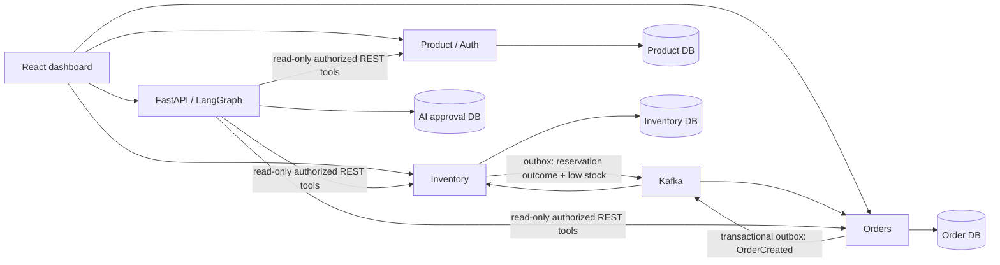

# StockGuard AI architecture

Four business services: Product (catalog and authentication), Inventory (stock, warehouses, audit), Order (order lifecycle), AI (forecasting, controlled LangGraph tools and approval records). A shared Java library contains only transport/security plumbing. PostgreSQL hosts isolated databases; services do not query each other's tables. REST serves synchronous reads. Kafka carries reservation requests and outcomes. React uses a same-origin reverse proxy.

